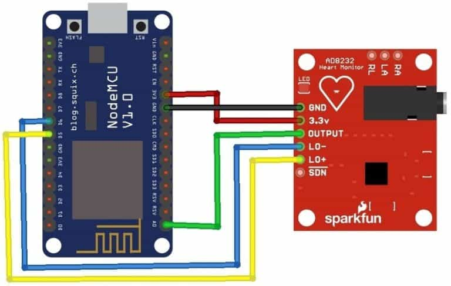
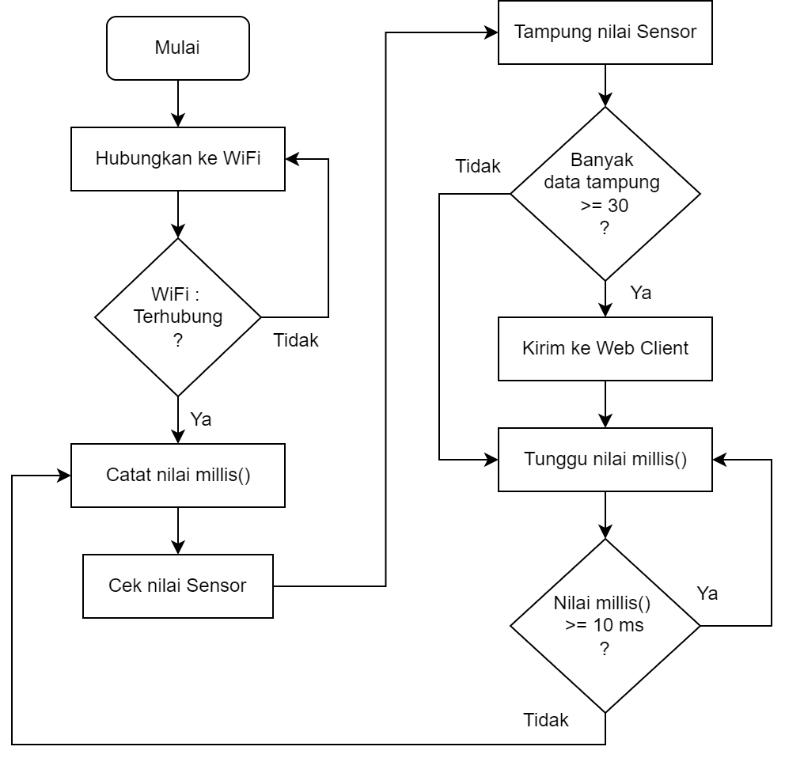
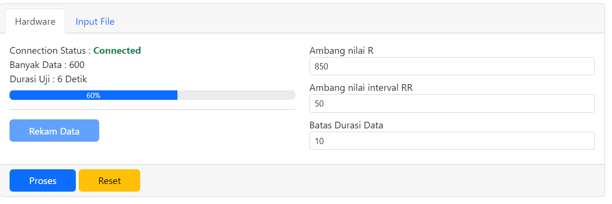
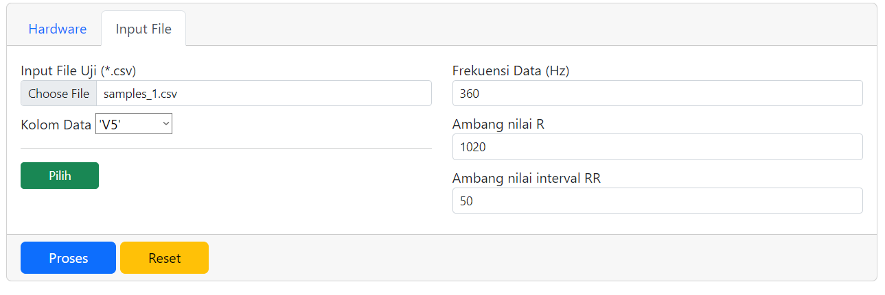
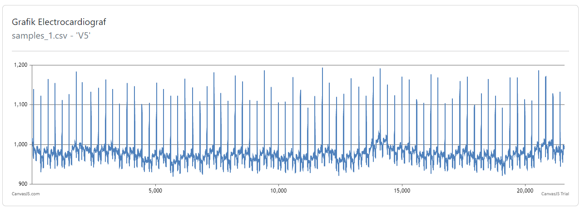
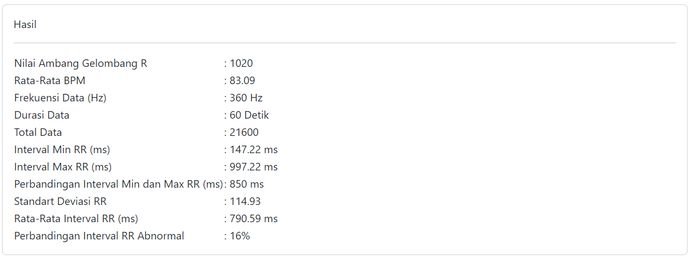

# Arduino
## Komponen
 - NodeMCU ESP8266
 - Modul AD8232


## Skema Rangkaian


## Flowchart Arduino



## Konfigurasi

### Konfigurasi WiFi
```
const char *ssid            = "AndroidAP";          //Access Point SSID
const char *password        = "12345678";           //Access Point Password
```


### Konfigurasi Pembacaan Sensor

Proses pembacaan sensor dilakukan dengan frekuensi 100Hz (tiap 10ms) kemudian dikumpulkan sebanyak 30 data dan dikirim ke web client

***Konfigurasi banyaknya data yang ditampung***
```
#define DATALIMIT 30        // Banyak Data yang ditampung
```
***Konfigurasi kecepatan pembacaan sensor***
```
int interval = 10;          // Delay pembacaan sensor
```

## Web

### Web Server
Halaman web disimpan di dalam LittleFs FileSystem image untuk mempermudah proses Development Halaman Web

[Cara Penggunaan LittleFs](https://github.com/earlephilhower/arduino-esp8266littlefs-plugin)

### Contoh Format Data Json yang dikirm Websocket
```
{ 
    "dataSample":[1,2,3,4,5,6,7,8,9,10.... dst]
}
```

## Refrensi
### Base Project

***WebSocket Server with ESP32 and Arduino IDE***\
https://iotdesignpro.com/projects/websocket-server-with-esp32-and-arduino-ide


### Basic AD8232 Sensor
***ECG Graph Monitoring with AD8232 ECG Sensor & Arduino***\
https://how2electronics.com/ecg-monitoring-with-ad8232-ecg-sensor-arduino/


### BPM
***AD8232 heart monitor: calculating BPM***\
https://forum.arduino.cc/t/ad8232-heart-monitor-calculating-bpm/447601
    
***Getting BPM from the given code***\
https://arduino.stackexchange.com/questions/43956/getting-bpm-from-the-given-code


### Library
***ArduinoWebSockets***\
https://github.com/Links2004/arduinoWebSockets

***LitleFs Plugin***\
https://github.com/earlephilhower/arduino-esp8266littlefs-plugin

# Halaman Web
## Library/Framework yang digunakan
- Vue js
- Bootstrap
- Reconnecting Websocket
- Canvas Js

## Metode Klasifikasi Detak Jantung


### Sumber Sample Data Detak Jantung
***Physionet ATM***\
https://archive.physionet.org/cgi-bin/atm/ATM

### Screenshoot Halaman Web
***Input Data dari Hardware***\

***Input Data dari File .CSV***\

***Grafik***\

***Hasil Klasifikasi***\



### Parameter Klasifikasi
- Ambang Nilai Gelombang R
- Ambang Nilai Interval RR
- Frekuensi Data (Hz)
- Batas Durasi Pengambilan Data (Apabila Menggunakan Hardware)

### Hasil Klasifikasi
- Rata-Rata BPM
- Durasi Data
- Total Data
- Interval Min RR (ms)
- Interval Max RR (ms)
- Perbandingan Interval Min dan Max RR (ms)
- Standart Deviasi RR
- Rata-Rata Interval RR (ms)
- Perbandingan Interval RR Abnormal

## Refrensi
### Base Project
***WebSocket Server with ESP32 and Arduino IDE***\
https://iotdesignpro.com/projects/websocket-server-with-esp32-and-arduino-ide

***Perhitungan standar deviasi***\
https://stackoverflow.com/a/53577159

***Konversi CSV ke Array***\
http://stackoverflow.com/a/1293163/2343

